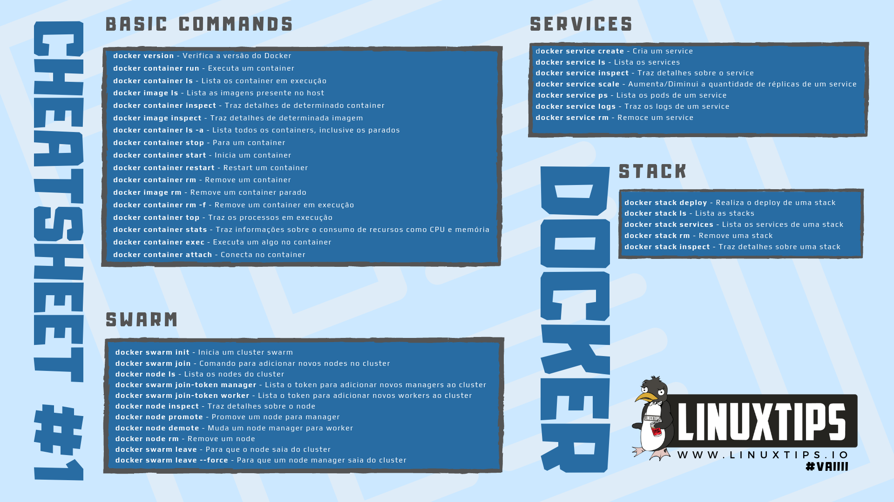

## [**LinuxTips: Descomplicando o Docker**](https://school.linuxtips.io/p/descomplicando-docker)

Diretório criado como material de apoio ao curso "Descomplicndo o Docker" fornecido pela [LinuxTips](https://linuxtips.io).

Este curso foi adquirido através de uma ação comunitária feita pelo [Jeferson Fernando](https://twitter.com/badtux_), onde ele distribuiu 5 mil acessos ao curso de sua plataforma de ensino de forma gratuita, com o objetivo de facilitar o acesso ao conhecimento por pessoas com menos condições.

O curso trata de uma uma trilha que inicia com os conhecimentos mais básicos sobre Containers, utilizando o [Docker](https://www.docker.com/), indo até um ponto onde o aluno possa manipular e utilizar o docker de maneira efetiva.

### **Glossário do docker**

* **Imagem**: Imagens Docker são arquivos compostos por vários sistemas de arquivos de camadas que ficam uma sobre as outras. Ela é a nossa base para construção de uma aplicação.
* **Container**: Container é um ambiente isolado, ele usa o kernel do sistema hospedeiro como base e baixa apenas o que é necessario para o funcionamento das aplicações desejadas.
* **Docker**: Um "container runtime" lançado em 2011, responsável pela criação e manipulação de containers. É um conjunto de ferramentas PaaS (Platform as a Service) que faz uma "virtualização" a nivel de SO.
* **Dockerhub**: É o repositório padrão onde o docker procura por imagens. Também é possivel armazenar imagens próprias e tem boa integração com github. Em resumo, é um repositório de imagens docker.
* **Docker compose**: É uma ferramenta que ajuda a definir e rodar aplicações multi-container de forma simplificada. Usa um arquivo YAML para configurar os serviços necessários para as aplicações e iniciar tudo com um único comando.
* **Docker Swarm**: Solução nativa do Docker para sistemas de Clusters para containers Docker.
* **Docker Volume**: Volume de dados isolados criados pelo docker que pode ser utilizado para persistir informações de containers.

### **Lista de comandos mais utilizados:**

Script de instalação automatizada do docker:
```bash
curl -fsSL https://get.docker.com/ | bash
```


Imagem retirada da aba de [Cheatsheets](https://www.linuxtips.io/cheatsheet) do Linuxtips.

* `docker version` --> Mostrar a versão do docker instalado.

* `docker container ls` --> Antigo `docker ps`, utilizado para listar os containers ativos.

* `docker container ls -a` --> Antigo `docker ps -a`, utilizado para listar todos os containers.

* `docker container run <nome da imagem>` --> Utilizado para subir o container. Pode ser utilizada a flag `-ti` para abrir o terminal do container de forma interativa ou `-d` para executar o container em modo "daemon", em segundo plano.

* Para sair do modo interativo sem matar o processo utilizamos a combinação de teclas `ctrl+p+q`.

* Para sair do modo interativo matando o processo utilizamos a combinação `ctrl+d`
* `docker container attach [CONTAINER ID]` --> entra em um container ativo em moto interativo.
* `docker container exec -ti [CONTAINER ID] [COMANDO]` --> Executa comandos no shell daquele container
* `docker container start [CONTAINER ID]` --> Inicia um container parado.
* `docker container stop [CONTAINER ID]` --> Para um container em execução.
* `docker container restart [CONTAINER ID]` --> Reinicia um container.
* `docker container pause [CONTAINER ID]` --> Pausa um container.
* `docker container unpause [CONTAINER ID]` --> "Despausa" um container.
* `docker container stats [CONTAINER ID]` --> Exibe os status de uso do container.
* `docker container top [CONTAINER ID]` -->
* `docker container run -d -m 128M --cpus 0.5 <nome da imagem>` --> a flag `-m` seta o limite de uso de memóra do container e `--cpus` seta o limite do uso de CPU.
* `docker container update [COMANDOS]` --> Atualiza detalhes em um container em execução.
* `docker container inspect [CONTAINER ID]` --> Exibe o manifesto de montagem do container.
* `docker image ls` --> Lista todas as imagens baixadas localmente.
* `docker image build` --> Constrói uma imagem a partir de um dockerfile.
  
  Para criar um diretório do tipo "bind" procedemos da seguinte maneira:
  ```bash
  docker container run -ti --mount type=bind,src=/<diretório-fonte>,dst=/<diretório-destino> <imagem>
  ```
  Caso você queira que o diretório seja do tipo "Read Only", basta por mais uma "vírgula" seguida de `ro`, após o caminho destino.
  
   `[...] type=bind,src=/<diretório-fonte>,dst=/<diretório-destino>,ro <imagem>`

* `docker volume ls` --> Lista os volumes criados
* `docker volume create <nome-do-volume>` --> Cria um volume com o nome desejado.
* `docker volume inspect <nome-do-volume>` --> Exibe informações sobre o volume.

  Para criar um diretório do tipo "volume" procedemos da seguinte maneira:
  ```bash
  docker container run -ti --mount type=volume,src=<nome-do-volume>,dst=/<diretório-destino> <imagem>
  ```
  Caso você queira que o diretório seja do tipo "Read Only", basta por mais uma "vírgula" seguida de `ro`, após o caminho destino.
  
   `[...] type=volume,src=<nome-do-volume>,dst=/<diretório-destino>,ro <imagem>`

* `docker container create <nome-da-imagem>` --> Cria o container sem iniciar.
* `docker container prune` --> Exclui todos os containers que não estiverem em uso. O prune pode ser usado para imagens e volumes também, mas recomenda-se cautela ao utilizar em volumes.
* 

### **Dockerfiles explicados**

Dockerfiles são documentos de montagem onde são postos os parâmetros do que esperamos que esteja presente nas nossas imagens docker. Em outras palavras, ele serve como base para construir um container, permitindo definir um ambiente personalizado que pode ser utilizado com os mais diversos propósitos.

As imagens docker, segundo o [Mundo Docker](https://www.mundodocker.com.br/o-que-e-uma-imagem/#:~:text=Images%20Docker%20s%C3%A3o%20compostas%20por,com%20Apache%2C%20PHP%20e%20MySQL.), são compostas por sistemas de arquivos de camadas que ficam uma sobre as outras. Ela é a nossa base para construção de uma aplicação.

No dockerfile podemos:
* Definir uma imagem oficial como base para ser modificada.
* Definir informações para a imagem (versão, descrição e autor/responsável).
* Criar a pasta onde serão enviados os arquivos carregados pelo site.
* Copiar o site para a imagem.
* Mapear uma pasta onde serão salva as imagens do site.
* Definir em qual porta o site irá rodar.
* Setar algumas variáveis de ambiente utilizadas no site.
* Definir qual será a pasta de trabalho da imagem (pasta que irá conter o site).

A seguir temos o [primeiro dockerfile](Dockerfiles/Primeiro%20Exemplo/Dockerfile) criado durante a aula do curso:

```Dockerfile
FROM debian

LABEL app="Teste1"
ENV ANDERSON="testando"
RUN apt-get update && apt-get install -y stress && apt-get clean

CMD stress --cpu 1 --vm-bytes 64M --vm1

```

Nesse dockerfile foi utilizada a "palavra-chave" `FROM` logo no topo do documento, para definir de qual imagem oficial nós iríamos buscar a base a qual vamos personalizar. Neste caso utilizamos a imagem do debian. 

Em `LABEL` podemos adicionar metadados à imagem no formato \<chave>=\<valor>. 

`ENV` \<chave>=\<valor> define a variável de ambiente \<chave> para o valor \<valor>. Este valor estará no ambiente em todas as instruções subsequentes durante o estágio de montagem.

`RUN` executa comandos durante o processo de montagem da imagem, não é aconselhável utilizar vários "runs" em um dockerfile, por isso costuma-se "concatenar" comando na lonha de RUN para evitar a criação de várias camadas no ponto de montagem, deixando a sua imagem grande sem necessidade. Em nosso primeiro dockerfile utilizamos o `&&` para concatenar os comando. A característica do `&&` é que o próximo comando será executado apenas se o comando anterior for finalizado com sucesso.

O programa "stress", que foi instalado, é utilizado para estressar os recursos da máquina para captura de informações para os mais diversos usos.

`CMD` pode ser apenas uma vez em um dockerfile, com o objetivo de passar instruções. Nesse caso ele foi utilizado para executar o programa que foi baixado e instalado com o `RUN`.

Essas foram explicações superficiais apenas com o objetivo de ter um meio de estudo e revisita das informações ganhas durante o curso. Provavelmente ainda irei alterar ou adicionar informações ao longo do curso.

### **Comandos Linux que aprendi** 

* `/<diretório> tar -cvf /<diretório-destino>/<nome-do-arquivo>.tar` --> Este comando empacota o diretório em um arquivo .tar. As flags `-c` de "Create", que vai criar o arquivo empacotado, `-v` de verboso, que mostrará todo o processo que está acontecendo aos fundos e `-f` de "file", necessário pra que a gente passe o arquivo que será criado.

Foi utilizado durante as aulas na criação de um conteiner que "faz bacups" em um volume de dados criado previamente.

```bash
docker container run -ti --mount type=volume,src=<nome-do-volume>,dst=/<diretório-destino> --mount type=bind,src=<diretório-fonte> <imagem> tar -cvf /backup/bkp-banco.tar /data
```
